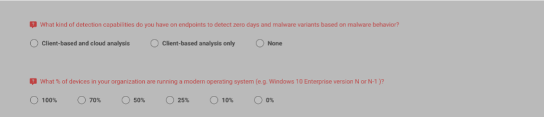

# About

This project is a security questionnaire that asks users about various aspects of security, categorized into different sections. When a user selects a category, they will see a list of related questions to which they can provide answers. Upon completion, they'll receive feedback regarding their level of knowledge and suggestions for improvement. but in this sample doesn't need to show result.

> [Material UI Library](https://mui.com/) is used in this project.

> **NOTE: First you must create a fork of the repository, Once you have completed the tasks, create a Pull Request.**

## Project description

The categories can be found in [categoryInfo.ts](./src/context/categoryInfo.ts). The categories include 'Phishing', 'DDoS', 'Ransomware', 'Crypto Jacking', 'Data Exfiltration'.The `questionCount` variable represents the number of questions in the category. The questions are located in the `data` folder. Each JSON file within the folder contains a set of questions.

The underlying json code has shown format data for each quesiton.

```json
{
    "id": 1, // question number
    "title": "Do you monitor all endpoints for active and up to date endpoint protection (AntiVirus)?", //  question
    "answerType": 2, // the number of options
    "options": [ // options for answer
      {
        "id": 5,
        "title": "No",
        "group": {
          "id": 1,
          "name": "Phishing"
        },
        "score": 0
      },
      ...
    ],
    "suggestion": "Adopting a strong and up to date endpoint protection policy is ..." // security suggestion
  }
```

## Tasks

- [ ] Refresh Question List: when `Task Assessments` button is clicked, refresh the question list to update with the selected categories.

- [ ] Load Correct Questions: When a category is selected, load the questions of that category. e.x DDOS =>load ddos.json file

- [ ] Ignore Duplicate Questions: When multiple categories are selected, ensuring that any duplicate questions are ignored.

- [ ] Show Error: after click on `Get Your Results` button, any question that is not selected should be highlighted in red color.



## NOTE

The underlying measurements are taken into consideration when reviewing your code:

1. SOLID
3. Clean code
4. Comments
5. Data Structures
6. Best practice Folder structure
